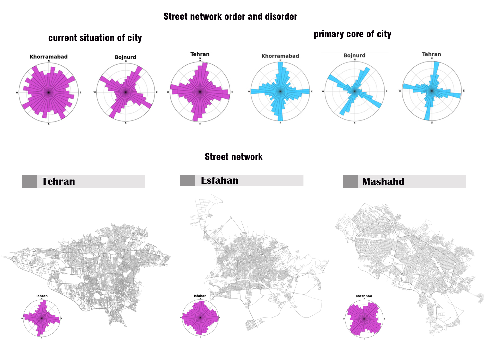

# Tehtan_Street_network
Exploring the spatial order of the street network provides important information about their development pattern and urban public spaces to urban designers. The results showes that the street network in the primary core of the formation of Tehran has experienced more order compared to its current situation

